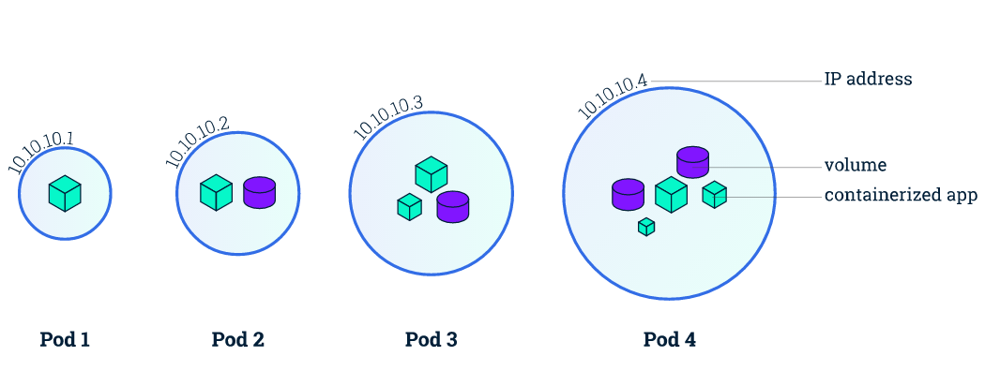

# Pods

- [Pod官方文档](https://kubernetes.io/zh/docs/concepts/workloads/pods/)

`Pod`是在kubernetes中创建和管理的最小的可部署计算单元。

Pod是一组（一个或多个）容器的集合（想象为豌豆荚）；这些容器共享存储、网络、以及如何运行这些容器的声明。  
Pod中的内容总是并置（colocated）的，并且一起调度，在共享的上下文中运行。Pod是特定于应用的“逻辑主机”所建模的，其中包含一个或多个的应用容器，这些容器是相对紧密的耦合在一起的。在非云环境中，在相同的物理机或虚拟机上运行的应用类似于在同一逻辑主机上运行的云应用。

Pod中除了包含应用容器，还可以包含在Pod启动期间运行的**init容器**，以及**临时性容器**（用于调式）。

## 生命周期

Pod起始阶段为`Pending`，如果至少其中一个主要容器正常启动，则进入Running，之后取决于Pod中是否有容器以失败状态结束而进入`Succeeded`或者`Failed`阶段。

Pod在其生命周期中只会被调度一次。一旦Pod被调度到某个节点，Pod会一直在该节点运行，知道Pod停止或者被终止。

和容器一样，Pod也是相对临时性的实体。Pod会被创建并赋予一个唯一的`ID`(UID)，且调度到某个节点，直到被终止（根据重启策略）或者被删除都在该节点上。如果节点挂掉了，则在该节点上的Pod也会在超时后被删除。

Pod本身不具有自愈能力。如果Pod被调度到某个节点后，该节点在某个时间挂掉，Pod则会被删除。同样的，当节点资源耗尽或者节点维护时Pod也无法继续存活。

- Pod结构图例

一个包含多个容器的Pod中包含一个用来拉取文件的程序和一个Web服务器，均使用持久卷作为容器间共享的存储。

## Pod阶段（Phase）

Pod的`status`字段时一个`PodStatus`对象，其中包含一个`phase`字段。Pod的阶段时Pod在其声明周期中所处位置的简单宏观概述。该节点不是对容器或Pod状态的综合汇总，也不是为了称为完整的状态机。

Pod阶段的数据和含义是严格定义的。除了以下内容外，不能再假定Pod有其他的`phase`值:

- Pending（等待）：Pod已经被Kubernetes系统接受，担忧一个或者多个容器尚未创建亦为运行。此阶段包括等待Pod被调度的时间和通过网络下载镜像的时间。
- Running（运行中）：Pod已经绑定到某个节点，Pod中所有的容器都已被创建。至少有一个容器仍在运行，或者正处于启动或重启状态。
- Succeeded（成功）：Pod中的所有容器都已成功终止，并且不会再重启。
- Failed（失败）：Pod中的所有容器都已经终止，并且至少有一个容器时因为失败终止。也就是说，容器以非0状态退出或者被系统终止。
- Unknown（未知）：因为某些原因无法取得Pod的状态。这种情况通常是因为与Pod所在的主机通信失败。
  
如果节点死掉或者与集群中其他节点失联，Kubernetes会实施一种策略，将失去的节点上运行的所有Pod的phase设置为`Failed`。

## 容器状态

可以通过以下命令查看pod中的容器状态：

    kubectl describe pod <Pod名称>

- **Waiting**（等待）：如果容器不处在`Running`或`Terminated`状态之一，它就处在`Waiting`状态。处于`Waiting`状态的容器仍在运行它完成启动所需要的操作，如：从镜像仓库拉取容器镜像，或者向容器应用Sectet数据等。当通过`kubectl`来查看包含`Waiting`状态的容器的Pod时，会看到一个Reson字段，给出了该容器处于等待状态的原因。
- **Running**（运行中）：容器正在执行状态并且没有问题发生。如果配置了`postStart`回调，那么该回调已经执行且已完成。如果使用`kubectl`查看包含运行中的容器的Pod时，也会看到关于容器进入`Running`状态的信息。
- **Terminated**（已终止）：处于终止状态的容器已经开始执行并且或者正常结束或者因为某些原因失败。如果使用`kubectl`来查询包含终止状态的容器的Pod时，会看到容器进入该状态的原因、退出大妈以及容器执行期间的起止时间。如果容器配置了`preStop`回调，则该回调会在容器进入`Terminated`状态之前执行。

## Pod重启策略

Pod有一个PodStatus对象，其中包含一个PodConditions数组。Pod可能通过可能通过也可能未通过其中的一些状况测试。

- `PodScheduled`：Pod已经被调度到某节点；
- `ContainersReady`：Pod中所有的容器都已就绪；
- `Initialized`：所有的Init容器都已经成功启动；
- `Ready`：Pod可以为请求提供服务，并且应该被添加到对应服务的负载均衡池中。
